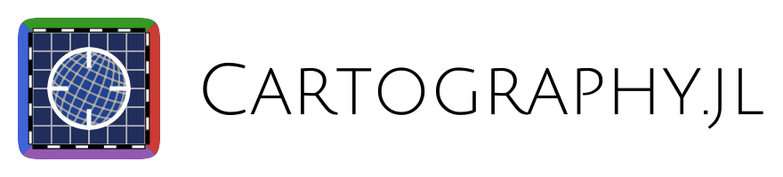

<p align="center">
  
</p>

[](https://github.com/JuliaEarth/CoordRefSystems.jl/actions/workflows/CI.yml?query=branch%3Amain)
[](https://codecov.io/gh/JuliaEarth/CoordRefSystems.jl)

CoordRefSystems.jl provides conversions between Coordinate Reference Systems (CRS) in native Julia.
It was designed to work with units from [Unitful.jl](https://github.com/PainterQubits/Unitful.jl),
respects projection bounds catalogued in <https://epsg.io>, and is very fast thanks to advanced
parametrizations at compile-time.

This package addresses various design issues encountered in previous attempts such as
[Geodesy.jl](https://github.com/JuliaGeo/Geodesy.jl) and [MapMaths.jl](https://github.com/subnero1/MapMaths.jl).
Our [benchmarks](benchmark/output.csv) show that CoordRefSystems.jl is often faster than [PROJ](https://github.com/OSGeo/PROJ),
which is the most widely used software library for cartography in the world (written in C/C++).

## Installation

Get the latest stable release with Julia's package manager:

```
] add CoordRefSystems
```

## Usage

### Basic usage

Consider the following conversions between `Cartesian`, `Spherical`,
`Cylindrical` and `Polar` coordinates to get started:

#### Cartesian <> Spherical

```julia
julia> cartesian = Cartesian(1, 1, 1)
Cartesian{NoDatum} coordinates
├─ x: 1.0 m
├─ y: 1.0 m
└─ z: 1.0 m

julia> spherical = convert(Spherical, cartesian)
Spherical{NoDatum} coordinates
├─ r: 1.7320508075688772 m
├─ θ: 0.9553166181245093 rad
└─ ϕ: 0.7853981633974483 rad

julia> convert(Cartesian, spherical)
Cartesian{NoDatum} coordinates
├─ x: 1.0 m
├─ y: 0.9999999999999998 m
└─ z: 0.9999999999999999 m
```

#### Cartesian <> Cylindrical

```julia
julia> cartesian = Cartesian(1, 1, 1)
Cartesian{NoDatum} coordinates
├─ x: 1.0 m
├─ y: 1.0 m
└─ z: 1.0 m

julia> cylindrical = convert(Cylindrical, cartesian)
Cylindrical{NoDatum} coordinates
├─ ρ: 1.4142135623730951 m
├─ ϕ: 0.7853981633974483 rad
└─ z: 1.0 m

julia> convert(Cartesian, cylindrical)
Cartesian{NoDatum} coordinates
├─ x: 1.0000000000000002 m
├─ y: 1.0 m
└─ z: 1.0 m
```

#### Cartesian <> Polar

```julia
julia> cartesian = Cartesian(1, 1)
Cartesian{NoDatum} coordinates
├─ x: 1.0 m
└─ y: 1.0 m

julia> polar = convert(Polar, cartesian)
Polar{NoDatum} coordinates
├─ ρ: 1.4142135623730951 m
└─ ϕ: 0.7853981633974483 rad

julia> convert(Cartesian, polar)
Cartesian{NoDatum} coordinates
├─ x: 1.0000000000000002 m
└─ y: 1.0 m
```

#### Special syntax

Julia's `convert` methods can be triggered with special
syntax assuming that a list of coordinates is available:

```julia
julia> Mercator[LatLon(0, 0), LatLon(30, 30), LatLon(20,30)]
3-element Vector{Mercator}:
 Mercator{WGS84Latest}(x: 0.0 m, y: 0.0 m)
 Mercator{WGS84Latest}(x: 3.33958e6 m, y: 3.48219e6 m)
 Mercator{WGS84Latest}(x: 3.33958e6 m, y: 2.25842e6 m)
```

The example above is equivalent to running
`convert(Mercator, latlon)` for all `latlon`
coordinates in the list.

### Advanced usage

CRS are most useful to locate objets in the physical world.
Given an ellipsoid of revolution and a standardized origin
(a.k.a. datum), it is possible assign coordinates to points
without ambiguity.

Below is an example converting geodetic `LatLon` coordinates
on the `WGS84Latest` datum to `Mercator`, `WebMercator`, and
`Robinson` projected coordinates on the same datum:

```julia
julia> latlon = LatLon(30, 60)
GeodeticLatLon{WGS84Latest} coordinates
├─ lat: 30.0°
└─ lon: 60.0°

julia> convert(Mercator, latlon)
Mercator{WGS84Latest} coordinates
├─ x: 6.679169447596414e6 m
└─ y: 3.482189085408618e6 m

julia> convert(WebMercator, latlon)
WebMercator{WGS84Latest} coordinates
├─ x: 6.679169447596414e6 m
└─ y: 3.5035498435043753e6 m

julia> convert(Robinson, latlon)
Robinson{WGS84Latest} coordinates
├─ x: 5.441866544132874e6 m
└─ y: 3.2085576115038935e6 m

julia> latlon = LatLon(30, 60)
GeodeticLatLon{WGS84Latest} coordinates
├─ lat: 30.0°
└─ lon: 60.0°

julia> mercator = convert(Mercator, latlon)
Mercator{WGS84Latest} coordinates
├─ x: 6.679169447596414e6 m
└─ y: 3.482189085408618e6 m

julia> convert(LatLon, mercator)
GeodeticLatLon{WGS84Latest} coordinates
├─ lat: 29.999999999999996°
└─ lon: 59.99999999999999°
```

It is also possible to convert between different datum, transparently.
In the following examples, we convert coordinates between the `WGS84Latest`
datum, currently an alias to `WGS84{1762}`, and the `ITRF{2008}` datum:

```julia
julia> latlon = LatLon{WGS84Latest}(30, 60)
GeodeticLatLon{WGS84Latest} coordinates
├─ lat: 30.0°
└─ lon: 60.0°

julia> convert(LatLon{ITRF{2008}}, latlon)
GeodeticLatLon{ITRF{2008}} coordinates
├─ lat: 30.00000000081754°
└─ lon: 59.99999999999999°

julia> mercator = convert(Mercator{WGS84Latest}, latlon)
Mercator{WGS84Latest} coordinates
├─ x: 6.679169447596414e6 m
└─ y: 3.482189085408618e6 m

julia> convert(WebMercator{WGS84Latest}, mercator)
WebMercator{WGS84Latest} coordinates
├─ x: 6.679169447596414e6 m
└─ y: 3.5035498435043753e6 m

julia> convert(WebMercator{ITRF{2008}}, mercator)
WebMercator{ITRF{2008}} coordinates
├─ x: 6.679169447596414e6 m
└─ y: 3.5035498436094625e6 m
```

### EPSG/ERSI codes

CRS are catalogued with numerical codes in <https://epsg.io>.
The package provides `EPSG{code}` and `ERSI{code}`, and the
utility `CoordRefSystems.get` function to query the database:

```julia
julia> CRS1 = CoordRefSystems.get(EPSG{4326})
GeodeticLatLon{WGS84Latest}

julia> CRS2 = CoordRefSystems.get(EPSG{3395})
Mercator{WGS84Latest}

julia> CRS1(0, 90)
GeodeticLatLon{WGS84Latest} coordinates
├─ lat: 0.0°
└─ lon: 90.0°

julia> convert(CRS2, CRS1(0, 90))
Mercator{WGS84Latest} coordinates
├─ x: 1.0018754171394622e7 m
└─ y: 0.0 m
```

## Credits

Most implementations in this package are adaptations from
[PROJ - Cartographic Projections and Coordinate Transformations Library](https://github.com/OSGeo/PROJ)
and its [list of references](https://proj.org/en/9.3/zreferences.html).
Our tests were designed to match their results to the last digit
via the [Proj.jl](https://github.com/JuliaGeo/Proj.jl) wrapper.
